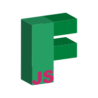

<div align="center">
    
    <p>The <b>new</b> way to create <em>progressive</em> Discord bots.</p>
    <p>
        <a href="https://discord.gg/FGn4T9eUp5">
            
        </a>
    </p>
</div>

# Highlights
- Express-like syntax
- Lightweight (only **two** dependencies)
- Fast
- Built-In Command Parser

# Quickstart
This assumes you have already setup a discord bot application in Discord. See
- [Creating a Bot Application](https://discordjs.guide/preparations/setting-up-a-bot-application.html)
- [Adding your bot to a server](https://discordjs.guide/preparations/adding-your-bot-to-servers.html#bot-invite-links)

```bash
$ npm init -y
$ npm i Fuwajs/Fuwa.js
$ echo > index.js
```
A file called index.js should be in your directory, open that in your IDE of choice and type
```js
const { Client } = require('fuwa');

const client = new Client(
    '?' // Your bot prefix here
);

// replace with your bot token
client.login('<your bot token>');

client.on('READY', () => {
    console.log('I am alive!')
);

client.command(['hi', 'hello'], (req, res) => { 
    res.send(`Hello there, my name is ${client.bot.username}!`); 
});

```
Check the [docs](https://Fuwajs.github.io/index.html) for more in depth examples.

join our [discord](https://discord.gg/FGn4T9eUp5) to interact with our community and ask questions!
